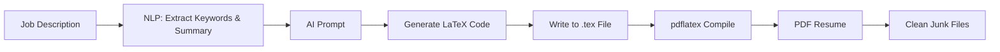

# 🛠️ Ultimate Resume Maker — Powered by AI + LaTeX

Generate a custom-tailored LaTeX resume PDF **automatically** from any job description.
Built for developers who want to **stand out** with laser-focused resumes.

> ✨ Reads the JD → 🔍 Extracts key info → 🧠 AI generates LaTeX → 📄 Outputs beautiful PDF

---

## 🚀 Features

- 🧾 **Reads Job Descriptions**: Parses and understands raw job text.
- 🔑 **Extracts Keywords & Role Summary** using NLP.
- 🪄 **Uses AI (LLaMA via Hugging Face)** to write LaTeX content dynamically.
- 📦 **Project Data from JSON**: Modular, reusable project info.
- 🖨️ **Compiles to PDF** using `pdflatex`.
- 🧹 **Cleans LaTeX Junk**: `.log`, `.aux`, `.out` etc. automatically deleted.
- ⚡ **Zero Static Sections**: Everything is generated on the fly. Truly dynamic.

---

## 🧠 How It Works



---
 # Main execution script
```

---

## 🛠️ Tech Stack

- **Node.js** for scripting the full pipeline
- **LaTeX (MiKTeX)** for professional PDF output
- **Hugging Face Inference API** using LLaMA 3
- **Custom CLI Workflow**
- **JSON-based modular data input**

---


## ⚙️ How to Run

```bash
# 1. Clone the repo
git clone https://github.com/najmulhc/resume-builder.git
cd resume-builder

# 2. Install dependencies
npm install

# 3. Add your Hugging Face API key to a .env file
echo "HF_API_KEY=your_api_key" > .env

# 4. Run the generator
node index.js
```

> 💡 Make sure MiKTeX or another `pdflatex` compiler is installed and added to PATH.

---

## 📌 Notes

- All resume sections (skills, education, projects) are dynamically selected based on JD content.
- The project is intended for **developer resumes**, but can be extended.
- Output format: Compact and ATS-friendly LaTeX-based PDF.

---

## 🤝 Contributing

PRs welcome! If you want to extend this for multiple resume formats, integrations with LinkedIn, or React frontends — let’s build it.

---

## 📣 Shoutout

> This project was ideated, stitched, and debugged by [Najmul Huda Chowdhury](https://linkedin.com/in/najmulhc) — a self-taught builder on a mission to break into top tech teams.

---

## 📜 License

MIT

---

## 🔗 Connect With Me

- 💼 [LinkedIn](https://linkedin.com/in/najmulhc)
- 🧑‍💻 [GitHub](https://github.com/najmulhc)
